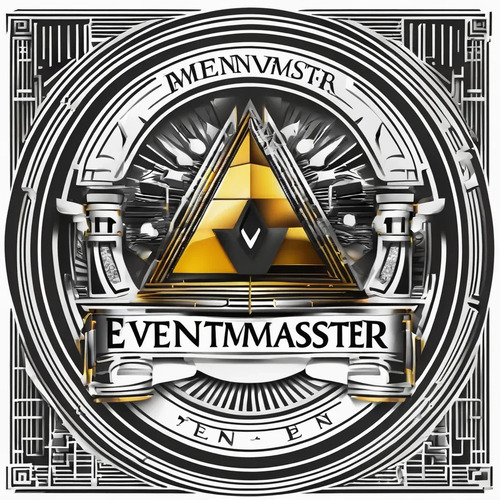

# Содержание

Добро пожаловать в документацию приложения "EventMaster"! Здесь вы найдете все необходимое для эффективного использования нашего инструмента.

1. [Введение](overview/overview.md)  
   Описание основного функционала и концепции приложения.  
   - [Основные функции](overview/features/features.md)  
     Ключевые возможности, которые облегчают управление мероприятиями.  
   - [Для кого подходит?](overview/audience/audience.md)  
     Узнайте, кто может максимально эффективно использовать EventMaster.

2. [Руководство пользователя](usage/usage.md)  
   Основные шаги для начала работы с приложением.  
   - [Как установить на Android?](usage/installation/android.md)  
     Пошаговая инструкция для Android устройств.
   - [Как установить на IOS?](usage/installation/ios.md)  
     Пошаговая инструкция для IOS.    
   - [Сценарии применения](usage/scenarios/scenarios.md)  
     Примеры использования в реальных ситуациях.

3. [Часто задаваемые вопросы](faq.md)  
   Ответы на наиболее распространенные вопросы.

Эта документация поможет вам освоить приложение и использовать его с максимальной эффективностью. Если у вас есть дополнительные вопросы, не забудьте посетить раздел [FAQ](faq.md).
